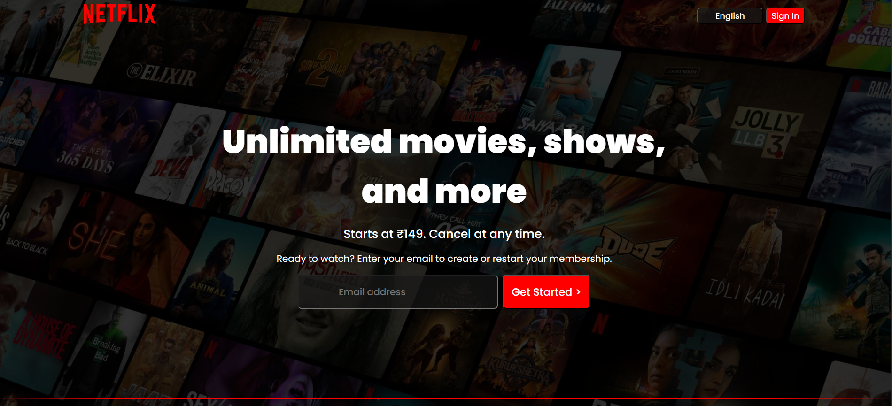
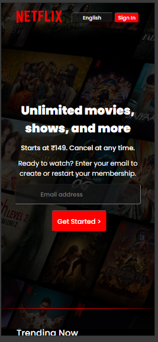

# 📺 Netflix Clone (CSS Only)

A fully responsive Netflix-inspired landing page built using **pure HTML and CSS only** — no JavaScript.

This project focuses on layout design, UI recreation, and responsive styling.

🔗 **Live Demo:**  
https://netflix-clone-taupe-two-94.vercel.app/

---

## 📸 Screenshots

### 🖥 Desktop View


### 📱 Mobile View


---

## ✨ Features

- 🎬 Netflix-style hero banner  
- 📺 Styled movie cards layout  
- 🎨 Clean dark theme design  
- 📱 Fully responsive layout  
- 📐 Flexbox and Grid based layout  
- 🎭 Hover effects with CSS transitions  
- 🧱 Component-based CSS structure  

---

## 🛠 Tech Stack

- HTML5  
- CSS3 (Flexbox & Grid)  
- Vercel (Deployment)

---

## 📂 Project Structure

netflix-clone/
│
├── assets/
│ ├── images/
│ └── videos/
├── favicon.ico
├── index.html
├── plus.svg
└── README.md
├── style.css


---

## ⚙️ Run Locally

```bash
git clone https://github.com/jayprakashm578/netflix-clone.git
cd netflix-clone
```

Open index.html in your browser.

No build step required.

## 🧠 Key Learnings
- Advanced layout structuring
- Responsive design techniques
- CSS Flexbox & Grid mastery
- Styling complex UI components
- Pixel-perfect UI recreation

## 🔮 Future Improvements
- 🎥 Add JavaScript interactivity
- 🎞 Add movie slider functionality
- 🔍 Add search bar
- ⭐ Add authentication system
- ⚛️ Convert to React

## 👨‍💻 Author
Jaya Prakash Mohanty
GitHub: https://github.com/jayprakashm578

⭐ If you like this project, consider giving it a star!